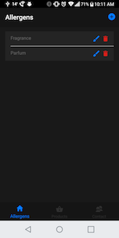
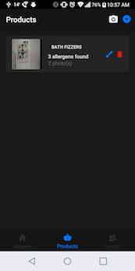
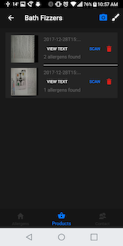
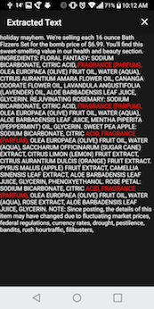

# Allergenify
## Overview
#### What
- Enables smartphone equipped users to scan product labels to detect the presence of (user supplied) allergens. 
- More generally, the app performs (case-insensitive) multi-term searchs against text extracted from images, where search terms are persistent. 

#### Why
- To aide people with known allergies in making informed product choices. 
- Does not require the user to retain all allergens and their aliases - just input it once.
- To learn and to practice. Clean Code - Tell Don't Ask/Law of Demeter, testing and TDD, type script, mobile app development 

#### Where
- Tested on:
  - iOS 11 (Xcode 9)
  - Android 7.1 (Android Studio 3)
- Should work on any mobile platform with Ionic / Cordova support. 


#### How
- Ionic 3+, Angular 3+, Typescript 2.6+, Cordova.
- Google Vision API for OCR and Label Detection

## Screens
#### Allergens 
- Allows users to add, edit, and remove allergens
#### Products
- Allows users to add, edit, and remove products
- Products may be added one of two ways
  - By image (the camera icon). An attempt will be made to extract the name of the product from the image. If the name cannot be determined, it defaults to the current datetime 
  - By manually entered name (the plus icon)
- Each line item displays the number of pictures attached to the product, the number of allergens - if any - found in the product, and whether or not it has been scanned.
#### Product
- Allows users to edit the product as well as add and remove pictures
- Here, pictures may be scanned (or rescanned) for text. 
- If text has already be extracted, then the results may be viewed
- Each line item displays the number of allergens detected, if any.
##### Product Scan Results
Displays which, if any, alleregens are detected in a product
##### Product Scanned Text
Displays the text extracted from a product, which allergens highlighed







## Developement
#### In-browser and/or Ioic Dev App
If you intend to use a local browser only workflow, run 
```
ionic serve
```

To faciliate capturing logs from device browsers/ Dev App, throw in the `-c` and optionally `--no-open` flags, like so
```
ionic serve -c --no-open
```

Live-reloading is backed into the `ionic serve` instrumentation

#### On device
```
ionic cordova run ios -lc --device
```

*Potential gotcha*: your device needs to be awake/unlocked by the time the command attempts to launch the app, or the process will fail

You can still access the app via the browsers by hitting the target IP and port as if it were started with `ionic serve`

## Testing

See https://leifwells.github.io/2017/08/27/testing-in-ionic-configure-existing-projects-for-testing/ for details on the 

#### Unit tests
One-off: `npm test`
Continious: `npm run test:watch`

#### End-to-end tests
Run `npm run test:e2e`
